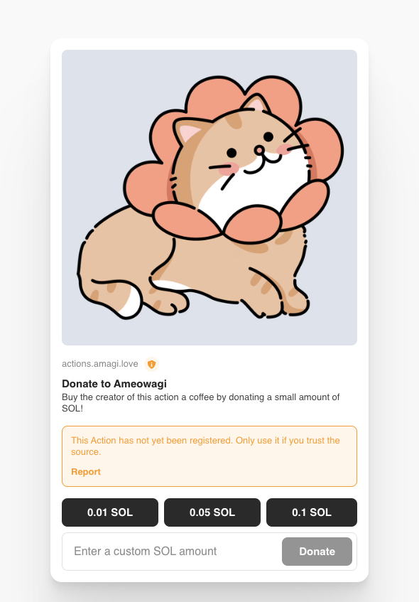

# Actions Next

Become a e-beggar, to be or not to be

## Developemnt

```
npm install
npm run dev
```

## Deploy

Using vercel, try using the vercel button, after the cloning process, you should able to setup your own repo and edit the config to your own.

[](https://vercel.com/new/clone?repository-url=https%3A%2F%2Fgithub.com%2FAmagiDDmxh%2Factions-next&env=RECIPIENT,BASE_AMOUNT,AVATAR,TITLE,DESCRIPTION,NEXT_PUBLIC_AUTHOR&envDescription=Variables%20to%20setup%20your%20own%20information&envLink=https%3A%2F%2Fgithub.com%2FAmagiDDmxh%2Factions-next&project-name=my-blink-donate-action-next&repository-name=my-blink-donate-action-next&demo-title=Solana%20blink%20action&demo-description=A%20solana%20blink%20action%20example%20using%20Next.js&demo-url=https%3A%2F%2Factions.amagi.love%2F&demo-image=https%3A%2F%2Fucarecdn.com%2F078daf34-3a0a-465b-bda8-8b6715ba86bb%2F-%2Fpreview%2F557x851%2F)

### Update your envrionments in the vercel settings

On the vercel deployment screen, add the environment values to your own settings

```shell
RECIPIENT="<Your wallet address>"
BASE_AMOUNT=0.1
AVATAR="<Your avatar URL>"
TITLE="<Your title>"
DESCRIPTION="<Your description>"
NEXT_PUBLIC_AUTHOR="<Your name>"
```

## Action Link

After this, you should able to see your deploy link in the dashboard, use it with dial link `https://dial.to/?action=solana-action:<your domain>/api`

Example to the https://dial.to/?action=solana-action:https://actions.amagi.love/api


